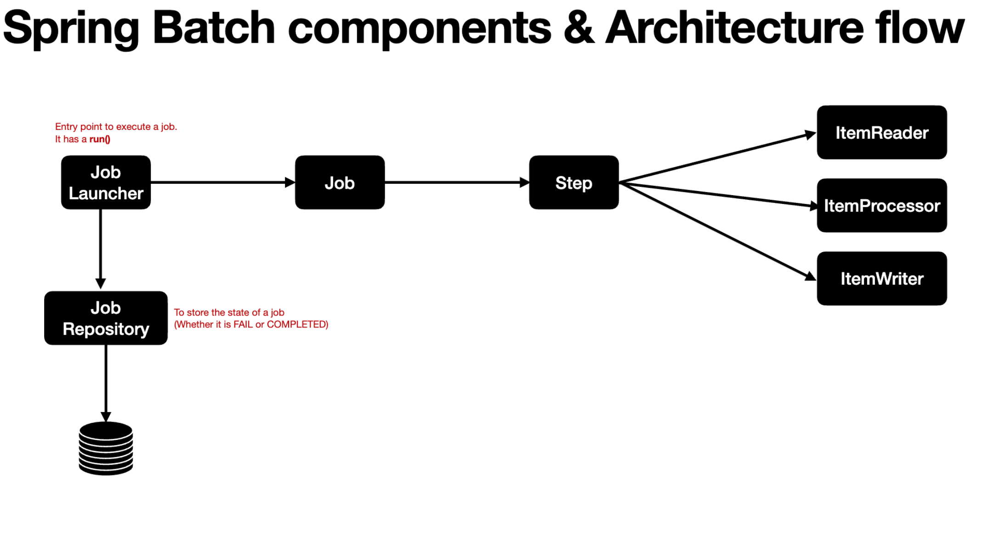

## Spring Batch Demo

#### Description

This application demonstrates spring batch operation by reading a .csv file and then writing its content to database post processing.

##### Steps to run the application

1. Ensure docker is running.
2. Spin up a postgres container by running `compose.yaml` file
3. Start the spring boot application
4. Start batch processing by making a post call to `localhost:8080/jobs/employee` 

##### Batch implementation steps 
1. Define reader, processor and writers.
2. Define Steps using reader,writer, processors.
3. Define job using steps (Job will require JobRepository and PlatformTransactionManager.
4. Define a JobRepository (also define datasource and initializers).
5. Create a JobLauncher to launch the job (In this app its an api endpoint that triggers batch run).

###### branch-skip-listeners

(Implements fault tolerance strategy for bad input data using skip policy)  
Define a listener for skip to perform any intimidation task such as logging the error out data   

Define a CustomSkipPolicy class and attach it to a step so that whenever a particular exception is triggered this skipPolicy is applied (skipPolicy contains the logic based on which skip will happen it can be skipCount , exception type etc). Post this define a 
CustomSkipListener class and log the errors there and attach this listener to the step. 